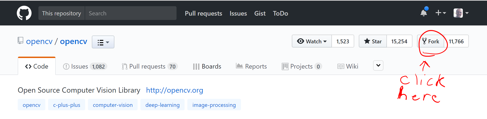
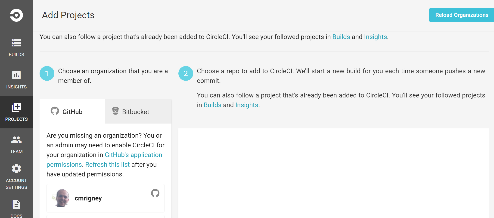
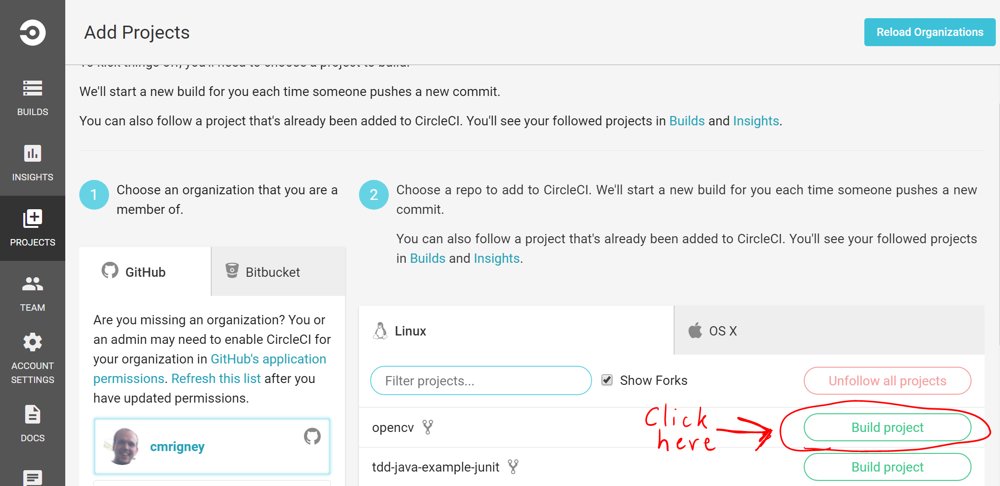
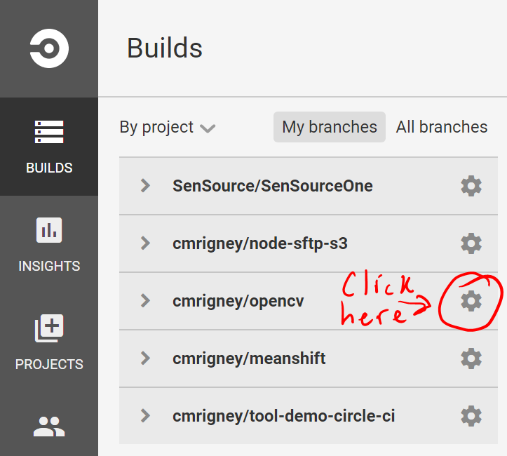
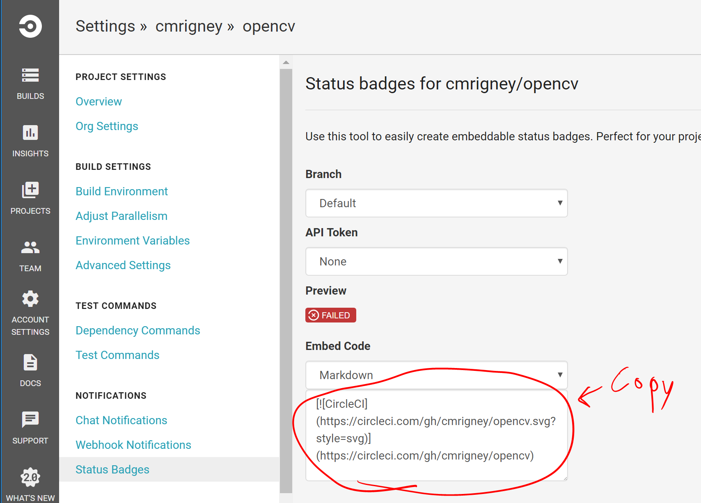
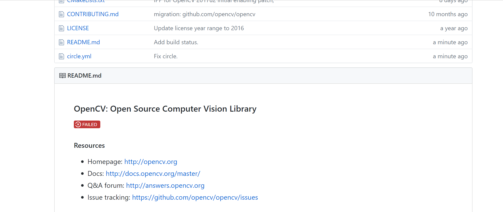

# Running OpenCV tests on CircleCI

## What is OpenCV?

[OpenCV](http://opencv.org) (Open Source Computer Vision Library) is an open source computer vision and machine learning software library. OpenCV was built to provide a common infrastructure for computer vision applications and to accelerate the use of machine perception in the commercial products. (Taken from [http://opencv.org/about.html](http://opencv.org/about.html).)

OpenCV includes unit tests which we can use to test OpenCV on CircleCI.  This example will show you the process to start testing OpenCV in a continous fashion on CircleCI.

## Forking OpenCV

We will begin by forking our own repository of OpenCV. Go to [https://github.com/opencv/opencv](https://github.com/opencv/opencv) and fork OpenCV as shown below.



## Creating a circle.yml file

In order to run the tests for OpenCV, we must first build it.  Before we can build it, we need to install some dependencies.  The tutorial for building OpenCV can be found [here.](http://docs.opencv.org/master/d7/d9f/tutorial_linux_install.html)

One way to setup these processes to install dependencies and build in CircleCI is by creating circle.yml file.  Let's start by cloning OpenCV.

```
git clone https://github.com/YOUR_USERNAME_HERE/opencv.git
```

Enter the newly created `opencv` directory and create a file called `circle.yml` at the root.

See the `circle.yml` documentation [here](https://circleci.com/docs/1.0/configuration/).

Populate your `circle.yml` file with the following.

```
machine:
  environment:
    OPENCV_TEST_DATA_PATH: ~/opencv-extra

dependencies:
  override:
    - sudo apt-get install -y build-essential
    - sudo apt-get install -y cmake git libgtk2.0-dev pkg-config libavcodec-dev libavformat-dev libswscale-dev
    - sudo apt-get install -y python-dev python-numpy libtbb2 libtbb-dev libjpeg-dev libpng-dev libtiff-dev libjasper-dev libdc1394-22-dev
    - git clone https://github.com/opencv/opencv_extra.git ~/opencv-extra

compile:
  override:
    - mkdir build && cd build && cmake -D CMAKE_BUILD_TYPE=Release -D CMAKE_INSTALL_PREFIX=/usr/local .. && make
  
test:
  override:
    - ./build/bin/opencv_test_core
```

Commit the new file and push it to your fork of the OpenCV repository.

## Setting it up on CircleCI

Now that we have prepared our project to be tested in CircleCI, we need to add the project to our CircleCI account.  This example assumes you have already setup a CircleCI account.  Go to `http://circleci.com` and click "Go to App" in the top right corner.  This takes you to your dashboard.  Click "PROJECTS" on the left navigation and you should land on a page that looks similar to this.



Next, click your account name and then "Build Project" for your opencv repository.



It takes a little while, but your tests should eventually finish.  At the time of this writing, there was one failed test on the master branch.  Hopefully all of your tests will be passing.

## Adding a Status Badge

You can also add a status badge to the project indicating test status.  Go to the "Builds" tab and click the gear next to your opencv repository.



Click "Status Badges" and copy the markdown then paste it into the top of your `README.md`



Now you will have the build status badge on your github page!



Again, hopefully yours will be passing!  From now on, each commit or PR will trigger a test to run on CircleCI which will update your status badge.

That's it!
